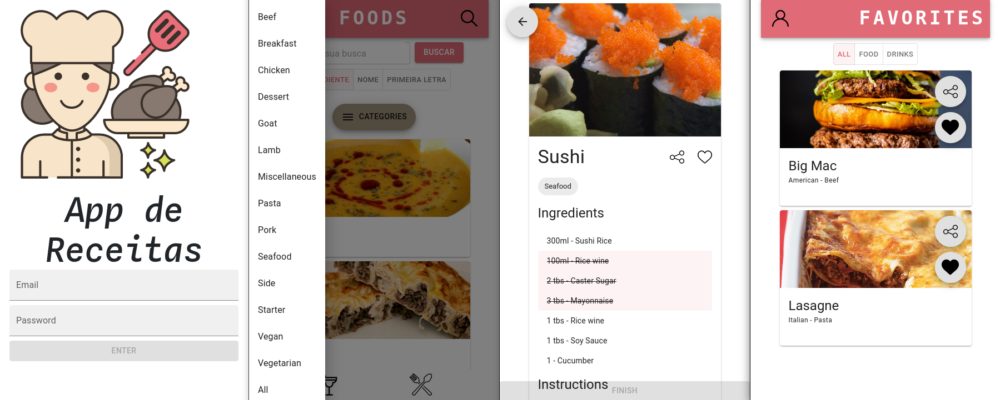

# Projeto Trybe - Recipes App

No app é possível procurar uma receita específica, explorar receitas baseado em diferentes critérios, favoritar e fazer as receitas, entre outras funcionalidades. 

#### Habilidades desenvolvidas:

- Utilizar a Context API do React para gerenciar estado
- Utilizar o React Hook useState
- Utilizar o React Hook useContext
- Utilizar o React Hook useEffect

Prints de algumas telas do app:

